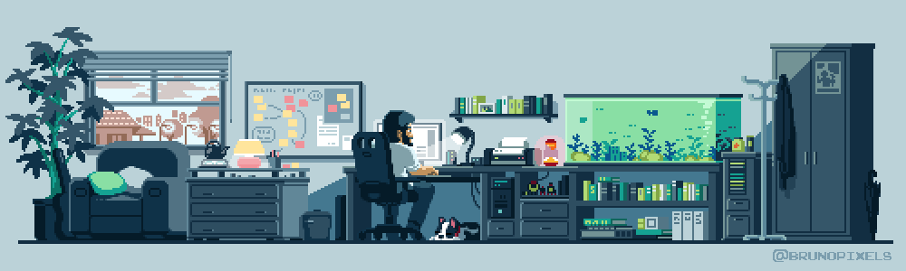

<!-- Imagem/GIF Principal -->

  

<!-- Nome -->

<h1>Antonio José</h1>

<!-- Descrição -->

<h3>Desenvolvedor de Software (Frontend & Backend)</h3>

 

<!-- Badges de Contato -->

<!-- Divisor -->

<!-- Seção Sobre Mim -->

<h2 align="left">📖 Sobre Mim</h2>

Desenvolvedor de software com sólida formação técnica pelo SENAC e atualmente cursando Ciência da Computação. Possuo experiência prática liderando equipes de frontend no desenvolvimento de projetos acadêmicos com Python (Flask), JavaScript e bancos de dados como MySQL e SQLite.
  
Sou apaixonado por criar soluções eficientes e escaláveis, aplicando a metodologia Scrum para garantir agilidade e qualidade nas entregas. Busco uma oportunidade para colaborar em um ambiente inovador, onde eu possa aplicar e expandir minhas habilidades em desenvolvimento de software.

<!-- Divisor -->

<!-- Seção Habilidades Técnicas -->

<h2 align="left">🛠️ Habilidades Técnicas</h2>
<table width="100%">
<tr>
<td width="50%" valign="top">
<h4 align="left">Linguagens</h4>

<h4 align="left">Frameworks (Backend & Frontend)</h4>

<h4 align="left">Banco de Dados</h4>

</td>
<td width="50%" valign="top">
<h4 align="left">Ferramentas de Design & Prototipagem</h4>

<h4 align="left">Metodologias & Gerenciamento</h4>

<h4 align="left">Microsoft Office Suite</h4>

</td>
</tr>
</table>

<!-- Divisor -->

<!-- Seção Formação Acadêmica -->

<h2 align="left">🎓 Formação Acadêmica</h2>

<strong>Graduação em Ciência da Computação</strong> (Cursando | 2025-2029) - Universidade Estácio de Sá
 
<strong>Técnico em Desenvolvimento de Sistemas</strong> (Concluído | 2024-2025) - Serviço Nacional de Aprendizagem Comercial (SENAC/DF)
 
<strong>Programador de Sistemas</strong> (Cursando | 2025-2025) - Serviço Nacional de Aprendizagem Comercial (SENAC/DF)

<!-- Divisor -->

<!-- Seção Estatísticas do GitHub -->

<h2 align="left">📊 Estatísticas do GitHub</h2>

  

